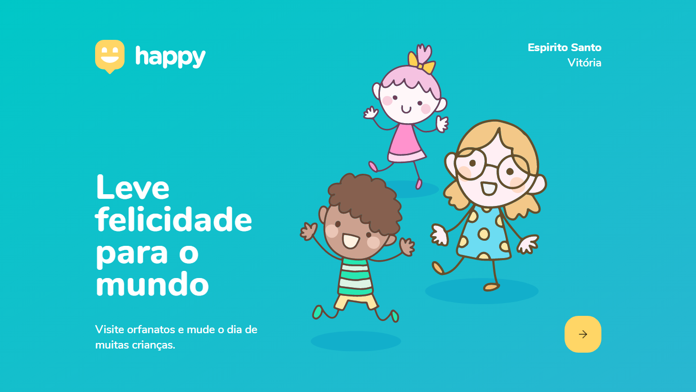
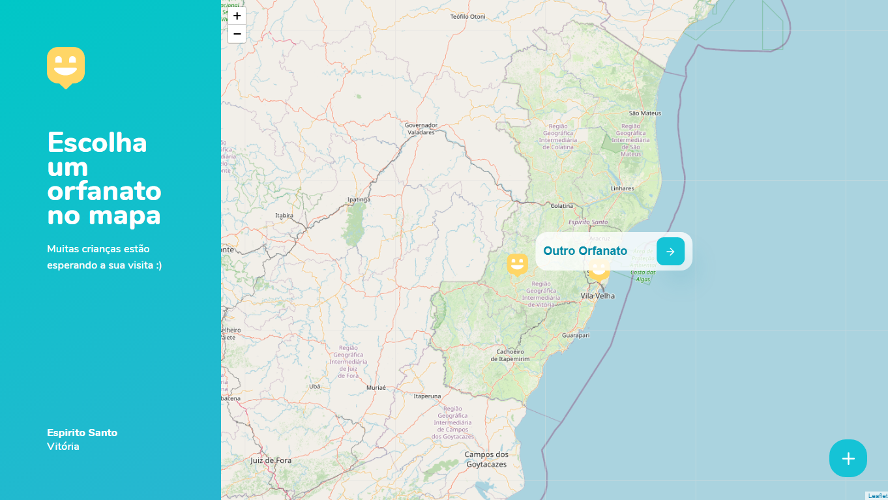
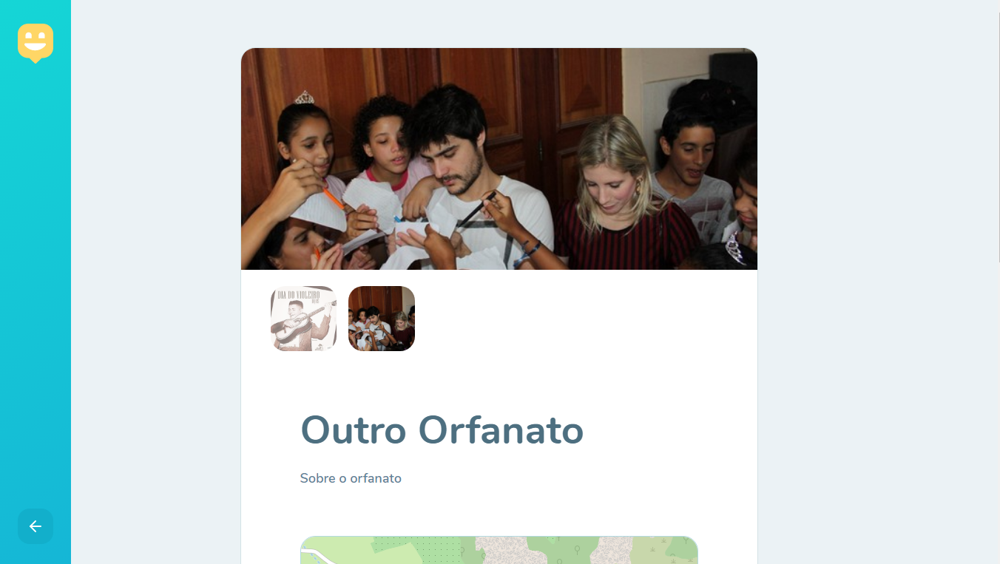
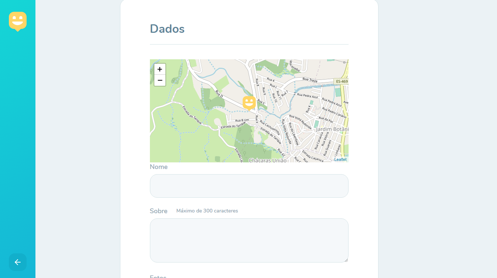

# Front-End HAPPY

Front-End desenvolvido com `React Js` com `template TYPESCRIPT`

## Scripts disponíveis `GitHub Clone`

No diretório do projeto, você pode executar:

Após fazer o clone ou download do projeto, execute `npm install` ou `yarn add` para que possa instalar todas as dependências que foram usadas.

# *API Desenvolvida com:* 
            * ReactJs - Template TypeScript

# *Dependências:* 
    "axios": "^0.20.0",
    "leaflet": "^1.7.1",
    "react": "^16.13.1",
    "react-dom": "^16.13.1",
    "react-icons": "^3.11.0",
    "react-leaflet": "^2.7.0",
    "react-router-dom": "^5.2.0",
    "react-scripts": "3.4.3",
    "typescript": "~3.7.2"

### `yarn start` ou `npm start`

Ao executar o aplicativo, o projeto vai abrir automaticamente no endereço [http://localhost:3000](http://localhost:3000).

Qualquer edição que você fizer no arquivo, a página sera recarregada. 

Você também verá os erros no console.

# ScreenShot Web

---
<h1 align="center">💻 Desenvolvido Por: Gilberto Júnior</h1> 